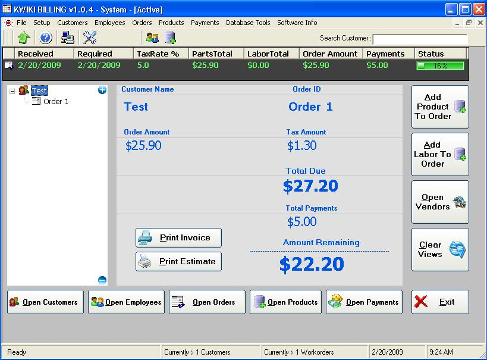



## KwikiBilling

### Description

KwikiBilling is a full scale invoicing and customer, Employee managment system and much more..

1.Invoice Management

2.Customer Management

3.Preview &amp; Print Invoices

4.Payment Management

5.Inventory Management

7.Employee Management

8.Company Setup

9. Etc...
 
### More Info
 

             |
---                |---
**Submitted On**   |2009-02-16 22:16:26
**By**             |[Kwiki Software](https://github.com/Planet-Source-Code/PSCIndex/blob/master/ByAuthor/kwiki-software.md)
**Level**          |Advanced
**User Rating**    |3.7 (11 globes from 3 users)
**Compatibility**  |VB 6\.0
**Category**       |[Complete Applications](https://github.com/Planet-Source-Code/PSCIndex/blob/master/ByCategory/complete-applications__1-27.md)
**World**          |[Visual Basic](https://github.com/Planet-Source-Code/PSCIndex/blob/master/ByWorld/visual-basic.md)
**Archive File**   |[KwikiBilli2144162162009\.zip](https://github.com/Planet-Source-Code/kwiki-software-kwikibilling__1-71779/archive/master.zip)

